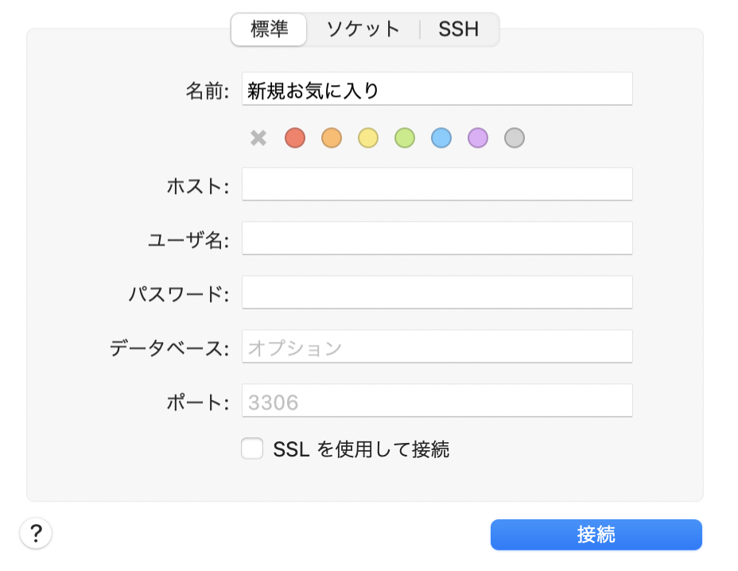

## 学ぶこと

- この学習で学ぶことは HTML や CSS ではありません
  - 今回 Tailwind というものを使用してますが CDN というのを利用してます。なのでネット環境がないと style があたりません
- PHP による Database への処理や Form の処理について簡易アプリケーションという形で学びます

# CRUD 機能を持つ簡易アプリケーションの作成を行います

## 処理フロー

1. 一覧にて登録されている情報を表示させる
2. 新規登録 Form を作成し登録を行える様にする

- Validation(バリデーション)という機能を作成し、入力を必ずしてもらう形にします

3. 登録した内容を編集できる様にする

- Validation(バリデーション)という機能を作成し、入力を必ずしてもらう形にします

4. 登録した内容を削除できる様にする

## 用意されているもの

1. 一覧ページ
2. docker-compose.yml

- Docker 関しては今は、細かいことは知らなくていいです。DB を PC にいれなくてもローカル環境にて DB の利用を可能にしています。

## 用意してもらうもの

1. PHP の動作が行える環境

- Mac ならデフォルトで入っていますので問題ありません。
- Windows の方は WSL を利用していただければ Mac と同等の環境を構築することが可能です。

2. VSCode

- 私も使用している IDE です。こちらで作業していただくことを推奨します

3. ブラウザ

- Chrome を推奨します。
- fire fox などでも問題ありませんが動作等は Chrome でしか確認してません

## 前提

- 学ぶことを参照してください
- ターミナルにて src ディレクトリ内にて`php -S localhost:8080` こちらのコマンドを実行してください
- ブラウザにて`http://localhost:8080`にアクセスしてください

## 準備

- ターミナルを開いてください
- [カリキュラム](https://github.com/hironeko/curriculum)を git clone してください
- Docker を導入してしましょう
  - [Download URL](https://matsuand.github.io/docs.docker.jp.onthefly/desktop/mac/install/)
  - Docker を起動します
- git clone したディレクトリにて下記コマンドを実行しましょう
  - `docker-composer up -d`
  - このコマンドを実行したことで DB が作成されます
- ログみたいなものが出力されなくなったら`docker-compose ps`を実行してください。UP の文字が確認できたら成功です

## 完成形を確認

- ターミナルにて sample ディレクトリ内で`php -S localhost:8080`を実行してください。実際に今回作成していただくアプリケーションが動く様になっているとおもいます。新規登録、更新(編集)、削除、一覧の基本的な CRUD 機能をもったアプリケーションです。実際に触ってみてください

## Part 1

### 新規登録を完成させよう

- PHP は、何かを DB に登録したり取得したりすることができる言語です。
  - DB とは？は割愛させてもらいます。→ [参照](https://qiita.com/matsukei/items/9dfae2df9e7e3aa4ecd2)

すでに Form は存在してます。こちらに何かを入力して、登録ボタンを押すとページは遷移しませんがリクエストが飛びます。

試しにどんなふうにデータが飛んでいるか確認しましょう。

まずは HTML タグの上に下記のように書きましょう

> create.php

```php
<?php
var_dump($_POST);
?>
```

早速何かしら入力して「登録」ボタンを押下しましょう

ページ上部に入力された内容が表示されましたでしょうか？
表示されたら問題ありません。

Form タグに括られた HTML の Input(type は色々あります)に入力されたものは、指定した URL にデータがリクエストとして送られます。

私たち Web 業界のエンジニアが主に使用する`HTTP Method`は主に以下です。

```text
GET // データの取得等に関しては主にこちらになり、1番よく使われます
POST // データの新規作成
PUT // データの更新時に使用します
DELET // 原則として使うことは稀です。理由はデータを物理的に削除する(DB上から)ということが稀だから使用頻度はかなり低いです
```

今回 Form タグの Method 属性に書かれているのは`POST`です。
理由は、上記一覧に書かれている新規作成の為`POST`にしてます。

PHP で POST で送られたデータは、`$_POST`で取得が可能です。

そのため今回入力されたデータの取得を行うのに使用しました。

Form タグの動きがわかりましたでしょうか？

Form タグによって送られたデータを DB に格納していきたいと思います

## Part 2

DB 接続の設定を書き、データを DB に入れたいのですが DB に対しての基本的な操作を覚えましょう

今回作成するアプリケーションでは docker の DB に対して接続を行います。
現状 DB を操作する方法が DB にコマンド絵直接アクセスする以外ありません

なので GUI(所謂アプリケーション、以下クライアントアプリと呼びます)を使用して操作しましょう
有名なアプリケーションですと`Sequel Pro`という無償で使えるものが存在してますのでダウンロードしましょう

クライアントアプリにて接続を行います。



接続先情報は以下になります。

```test
ホスト : 127.0.0.1
ポート : 3006
ユーザー名 : root
パスワード : root
データーベース ： test
```

接続テストのボタンが存在してますので接続テストしましょう。
成功したら早速アクセスしてみてください

この Table の User というものにデータが格納されていきます

## Part 3

DB に関して少し知れたので実際に DB にデータを入れていきたいと思います

そのためにまずは PHP で DB へ接続するために設定を書きます

手法は、何種類か存在していますが今回は`new PDO()`という PHP の組み込み関数をします。

なぜこちらを使用するかと言いますと接続先の DB の種類が変わっても簡単な修正で対応が可能です
(今回は、Mysql を使用します。また別の DB を使用することはありません)

では早速書いていきたいと思います。

```php
$dsn = 'mysql:dbname=test;host=127.0.0.1;port=3006';
$user = 'root';
$password = 'root';

try {
    $db  = new PDO($dsn, $user, $password);
} catch (PDOException $e) {
    echo "接続に失敗しました：" . $e->getMessage() . "\n";
    exit();
}
```

上記のように`HTML`タグの上(\$\_POST を書いた PHP タグの中)に書いてください。
これで接続が可能になってます。
コードの説明を簡潔に行います。

最初の方に書かれている文字列は、DB に接続するための接続先情報となります。

- try catch

エラーハンドリングを行うためによく使う構文となります。
今回ですと`new PDO()`という class をインスタンス化してます。
引数を渡してインスタンス化を行っていますが失敗することがあります。

例えば、DB 自体が起動していない場合、DB の接続先情報が正しくても接続することが難しい状態になります。

その際、PDO クラスは、Exception というエラー(例外)を出力します。

エラー内容は、まちまちですが例でいうと「DB に接続できません」と英語で出力されます。

このエラーをハンドリング(対応)します。その方法としてこの構文を使用してます。

catch に括弧ないにある`PDOException`がそれに当たります。

このエラーには、なぜエラーになったかのメッセージが含まれます。
なのでどうしてエラーになったか知るためにはちゃんとエラーを検知して対応を行う必要があります。

この書き方は、基本的な書き方になり、他のプログラミング言語でも見かけます。

またこの try catch の使用に関しては、一つの方法なので必ずしも使うか言われるとそうではありません。

この先学ぶ Laravel では、try catch を使う場合と使わない場合があります。

またこれは実装方針によっても変わってきますので、一つの方法として覚えておきましょう！

## Part 4

DB に接続するための記述を行いました。

PDO クラスをインスタンス化ができたら接続された状態のオブジェクトが変数に格納されています

(少しわかりづらい文章になってますが、DB に接続している状態が変数に格納されているからその変数を使うことで DB に対しての操作が可能なんだなと認識していただけると)

この変数を使用して、DB に対してデータを格納する処理を書いていきます。

ここでは、DB に対して操作するための言語である SQL に関しては、
基礎のみしか学びません。

またこの簡易アプリケえーションを作成する過程で学べる SQL は以下です

```sql
SELECT * FROM Table_Name;
INSERT INTO Table_Name (column1, column2) values (value1, value2);
UPDATE Table_Name SET column1 = value1;
```

基本的な`SELECT`, `INSERT`, `UPDATE`の 3 個が出てきます。

SQL は、奥が深く上記のような簡潔な SQL を書くことはほとんど稀です。

この先で学ぶ Laravel では、複雑な SQL が書く必要がある処理だったとしても ORM という DB に対しての処理をよしなにやってくれるライブラリを使用しますので Laravel を使用する実装者は、直感的に処理を書くことができます。

では実際に Form から送られてきたデータを DB に格納する処理を書いていきましょう

また大前提として SQL インジェクションという攻撃を受けないために Form のデータを検証した上で DB に格納したいと思います。

※SQL インジェクションについての説明は、割愛します

そのため今回は PDO クラスが用意している以下のメソッドを使用して処理を書きます

```
prepare() // クエリの実行準備を行うメソッド
↓
bindValue() // クエリ内の値の設定を行うメソッド
↓
execute() // クエリを実行するメソッド
```

この処理の流れで書くことによって SQL インジェクションを防ぐことができます。

## Part 5

実際に保存処理を書いていきましょう

以下のように書きます。

※書く場所は、PHP タグ内に書いていきます。

```php

if (!empty($_POST)) {

    $name = $_POST['name'];
    $tel = $_POST['tel'];
    $address = $_POST['address'];

    $sql = "INSERT INTO users (name, address, tel) VALUES (:name,:address, :tel)";
    $stmt = $db->prepare($sql);
    $stmt->bindValue(':name', $name, PDO::PARAM_STR);
    $stmt->bindValue(':tel', $tel, PDO::PARAM_STR);
    $stmt->bindValue(':address', $address, PDO::PARAM_STR);
    $stmt->execute();
    header('Location: http://localhost:8080');
}
```

書いたコードの説明を行います。

- if 文

なぜ if を用いているかというと POST された値が存在している時にだけ SQL の実行を行いたいからです

- 変数：\$sql

単純な文字列を記述しています。最後の`execute()` でこの SQL 文が実行されます。

実際に Form に何かしらを入れて登録ボタンを押下してみましょう。

登録ボタンをおしても今は、画面に何も変化がないとおもいます。一覧に新しくデータが追加されたりということもないでしょう。

DB のクライアントアプリケーションを使っているので実際に table の中を確認してみましょう。

`users`table をクリックし、内容という箇所をクリックすると保存されたデータがみれたと思います。

登録に関しては以上になります。

最後にデータ作成後に一覧へ遷移するため PHP の組み込み関数の`header`を使用し、遷移させております。
