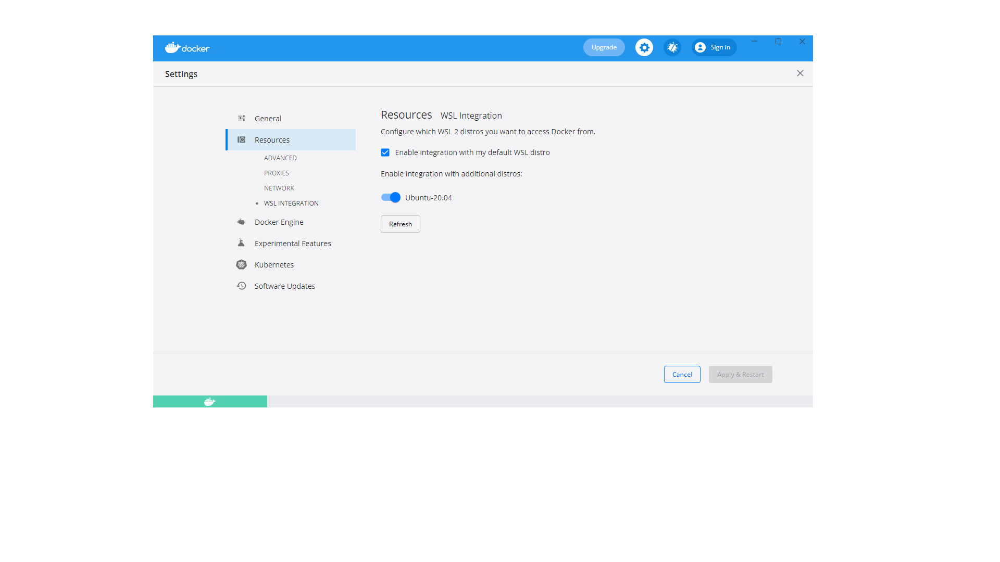

## 学習環境構築

- PHP の基礎実装と Laravel の基礎実装
- SQL 基礎

#### Mac

#### M1 Macをしようしている人

- docker-compose.ymlを使用せず、docker-compose.yml-for-M1を`docker-compose.yml`にリネームして使用していください。
  - その際すでにそんざいしているfileは削除してください

##### PHP

- 本カリキュラムでは、PHP の version は、7.4.\*以上を推奨します。

##### DB

- Docker の install を行います

[ダウンロード](https://matsuand.github.io/docs.docker.jp.onthefly/desktop/mac/install/)

上記ダウンロードリンクから Docker のダウンロードを行い、ページに記載ある手順で install を行なってください

- DB の利用

本カリキュラムでは、DB はすべて Docker を使用します。当ディレクトリ(カレントディレクトリといいます)で下記コマンドを実行してください

```shell
docker-compose up
```


上記コマンド実行後にログが出力されるようになりましたら一度 Docker を停止します。

CTL + C で止めることができます。

今後は下記コマンドでバックグランド実行します。

```shell
docker-compose up -d
```

#### Windows

- WSL2 を使用して環境を作成します。下記 URL を参考にまずは WSL2 の install を行なってください

[手順](https://docs.microsoft.com/ja-jp/windows/wsl/install)

- Docker の install を行います。

[ダウンロード](https://docs.docker.com/desktop/windows/install/)

- install 後下記手順を踏んでください

- Docker の設定を開き下記の画像のようになるように操作してください



- 操作が完了したら WSL のターミナルを開き下記コマンドを実行し、コマンドが使えることを確認してください。

```shell
which docker-compose
```

- DB 環境を作成します

```shell
docker-compose up
```

Mac の手順同様ログが出たら一度止め、Mac の手順と同じようにコマンドを実行しましょう

- Windows の場合、WSL2 には PHP が入っていません。適宜ダウンロードし使えるようにしましょう。

> PHP の version は、必ず 7.4 以上を入れるようにしましょう。また下記コマンドを実行すれば必要なものが大方入り動作させることが可能になると思います

- 下記7.4という数字は自身のPCでしようされているPHPのversionに合わせてください
  - 7.4と書かれている箇所を自身のPCに入っているPHPのversionに合わせましょう

```shell
$ sudo apt install -y php7.4 php7.4-zip php7.4-mbstring php7.4-xml php7.4-mysql unzip
```
