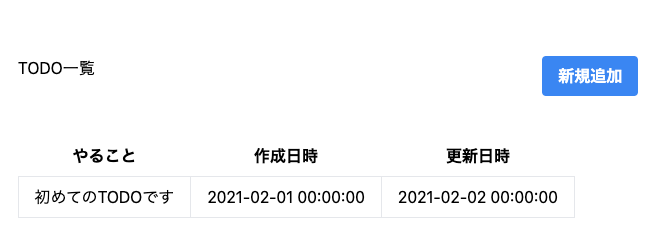

# View を作って行く

## 前章で必要となるものは、用意しました

- 次にブラウザで表示するために使用する html file の作成を行います。
- resources/views/todo/index.blade.php を作成します。
- ただしその前に Laravel における View について知る必要があります。

## Blade というもの

- 種類：テンプレートエンジンと呼ばれるもの
- 他のテンプレートエンジンと異なる点として PHP を直接記述することを許容している
- 利点：テンプレートの継承とセクション

ざっくりあげるとこのような特徴を持っています。

では、実際にどのようにしようするのか？

Web ページは、多くの共通する記述が存在します。
例えば、`<head>`タグ内の記述、`<header>`タグなどを利用した heder と呼ばれる箇所、`<footer>`タグを利用した footer と呼ばれる箇所など多くの共通する記述が存在します。
それらを新たにページを作成するたびに記述しているのは、エンジニアとして怠惰です。
共通する処理、記述などは、基本的に一箇所にまとめるべきです。
なので今回作成する Laravel でも同様に共通するであろう箇所は、全て共通かつ大元のテンプレートファイルとして独立させ、また各ページの view のファイルを読み込むように設定してあげます。

## file を置くディレクトリ作成

```shell
mkdir resources/views/layouts resources/views/todo
```

同時に 2 個のディレクトリを作成しました。
1 個は、テンプレートになる file が格納されるディレクトリ
1 個は、各ページの file が格納されるディレクトリとなってます。

早速雛形となる file の作成を行います。

Mac の方は、コマンドで file を作成しましょう。

```shell
touch resources/views/layouts/app.blade.php
```

エディタを開き早速中身を書いていきます。

```html
<!DOCTYPE html>
<html lang="ja">
  <head>
    <meta charset="utf-8" />
    <meta http-equiv="X-UA-Compatible" content="IE=edge" />
    <meta name="viewport" content="width=device-width, initial-scale=1" />
    <title>Laravel</title>
    <script src="https://cdn.tailwindcss.com"></script>
  </head>
  <body>
    <div class="container">
      <div class="mt-20 mb-10 flex justify-between">
        <h1 class="text-base">TODO一覧</h1>
        <button
          class="bg-blue-500 hover:bg-blue-700 text-white font-bold py-2 px-4 rounded"
        >
          <a href="{{ route('todo.create') }}">新規追加</a>
        </button>
      </div>
      <div>
        <table class="table-auto">
          <thead>
            <tr>
              <th class="px-4 py-2">タイトル</th>
              <th class="px-4 py-2">やること</th>
              <th class="px-4 py-2">作成日時</th>
              <th class="px-4 py-2">更新日時</th>
            </tr>
          </thead>
          <tbody>
            <tr>
              <td class="border px-4 py-2"></td>
              <td class="border px-4 py-2"></td>
              <td class="border px-4 py-2"></td>
              <td class="border px-4 py-2"></td>
            </tr>
          </tbody>
        </table>
      </div>
    </div>
  </body>
</html>
```

上記内容をそのまま file に書きましょう。

- 次に Controller の修正を行い、下記の様に修正します。

```php
<?php
declare(strict_types=1);

namespace App\Http\Controllers;

use Illuminate\Http\Request;

class TodoController extends Controller
{
    /**
     * Display a listing of the resource.
     *
     * @return \Illuminate\Http\Response
     */
    public function index()
    {
        return view('layouts.app'); // 変更
    }
```

- view()
  - view()メソッドを使用することで描画する blade file を指定します。この記法は、blade を使用する上でひっすになります。
  - 他の使い道としては、mail の機能を実装する際に使用することが多いです。

この状態でブラウザではどのように見えているのかを確認したいと思います。
なので Laravel のローカルサーバを立ち上げましょう。

```shell
php artisan serve
```

では、ブラウザで*127.0.0.1:8000/todo*と入力し確認をしましょう。下記画像の様に表示されましたでしょうか？


